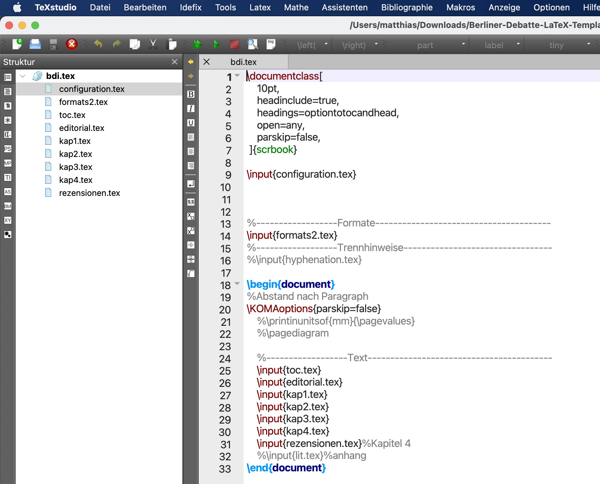
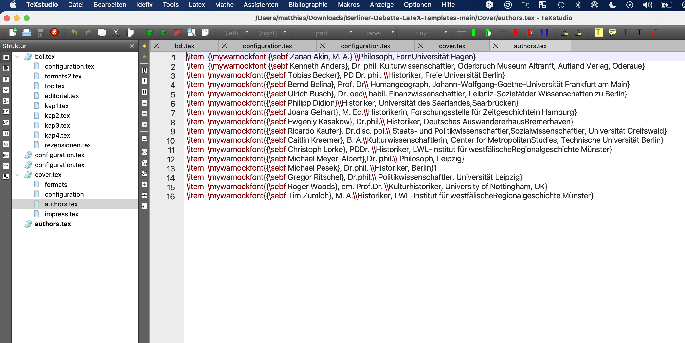

# Berliner Debatte LaTeX Templates
**Dokumentation des LaTeX Style für Berliner Debatte Initial.**

# Einführung in das Setzen eines Hefts der Berliner Debatte Initial

Der Satz der Berliner Debatte Initial erfolgt ab der nächsten Ausgabe mit LaTeX. 

## Was ist LaTeX

LaTeX ist ein Programm und eine Art der Dokumentauszeichnung. LaTeX ermöglicht, wissenschaftliche Arbeiten zu verfassen ebenso wie Briefe, Präsentationen und auch Zeitschriften, wie die Berliner Debatte Initial. Die Idee dahinter ist eine Fokussierung auf die Inhalte zu ermöglichen und das Setzen des Textes beinahe vollständig zu automatisieren.

LaTeX verwendet Befehle zum setzen des Textes. Jeder Befehl beginnt mit einen \\ gefolgt von einem Wort, z.B.

        \chapter

für ein neues Kapitel.

Formatierungen der Inhalte werden von den Inhalten getrennt abgelegt und durch die entsprechenden Befehle auf die Inhalte angewendet, z.B.

        \newfontfamily{\chapterfont}{WarnockPro-Regular.otf}
        \renewcommand\huge{\@setfontsize\huge{20}{20}}
        \addtokomafont{chapter}{\chapterfont\huge}

um jede Kapitelüberschrift im gesamten Dokument mit der Schriftart Warnock-Pro Regular in Schriftgröße 20pt, linksbündig und mit einzeiligem Abstand zu setzen.

## LaTeX auf deinem Computer installieren

Wichtig ist eine sogenannte LaTeX Distribution herunterzuladen. Unter Windows empfiehlt sich Miktex[^1], unter MacOS empfiehlt sich MacTex[^2]

Das installieren von LaTeX funktioniert genauso wie bei jedem anderen Programm, Pakete herunterladen und anklicken und dann warten bis die Installation fertig ist.

## LaTeXEditor zum bearbeiten der Dateien und erzeugen von PDF Versionen

Darüber hinaus ist es sinnvoll einen Editor[^3] zu installieren, mit dem du LaTeX Dateien bearbeiten und kompilieren[^4] kannst. Den Editor musst du herunterladen und auf deinem Computer installieren.

Da LaTeX Dateien reine Textdateien sind hilft ein Editor dabei den Überblick zu behalten. So werden z.B. die Befehle farblich dargestellt und das Bauen der PDF Datei kann auch aus dem Editor heraus erfolgen.
Ausserdem sieht man auf der linken Seite im Editor alle Dateien, die zum Projekt gehören.

### Basiskonfiguration des Editors

TeX-Studio hat viele Einstellungen. Fast alle Einstellungen können nach der Installation so bleiben wie sie im Standard sind. 

Für die Erzeugung der Berliner Debatte muss nur eine Einstellung geändert werden. Die PDF Datei der Berliner Debatte wird mit dem LaTeX Compiler **LuaLaTeX** erzeugt. Öffne die Einstellungen von TeX - Studio und klicke auf "Erzeugen". Dort wähle **LuaLaTeX** als Standard Compiler aus.

# Berliner Debatte in LaTeX setzen

Um ein neues Heft zu setzen benötigst du alles im oberen beschriebene, das macht dich rein technisch gesehen arbeitsfähig. Außerdem benötigst du alle Vorlagen. In den folgenden Abschnitten wird beschrieben wie du mit Hilfe von LaTeX und den bereitgestellten Vorlagen ein komplettes Heft setzen und für den Druck und Webverkauf vorbereiten kannst. 

## Vorlagen herunterladen

Alle Vorlagen sind in einem öffentlich zugänglichen Speicher abgelegt. Die Ablage in diesem Speicher unterstützt die effiziente Verbesserung der Vorlagen, da sie alle Veränderungen an den Dateien mitspeichert und eine effiziente Zusammenarbeit bei der Verbeserung der Vorlagen ermöglicht. Außerdem können so auf einfache Weise weitere Personen in den Vorlagenbesserungsprozess eingebunden werden.

Um ein neues Heft zu erstellen gehe bitte auf [github.com](https://github.com/mazewei-berlin/Berliner-Debatte-LaTeX-Templates/#berliner-debatte-latex-templates) und lade dir alle Vorlagen herunter. 

Klicke auf den grünen Button "Code" und dann "Download ZIP". Ein Zip Archiv wird in deinem Download Ordner gespeichert. Am Mac sieht es nach dem Download im Download - Ordner so aus.

Entpacke den Ordner durch anklicken und starte den LaTeXEditor. Öffne die Dateien, wie du es von Word oder Excel kennst.

### Struktur der Vorlage

Wenn du die Vorlage entpackt hast findest du einen Ordner mit folgender Struktur

1. Cover
2. Dokumentation
3. Heft

Im Ordner "Cover" findest du alle Dateien um ein Cover für den zweiseitigen Druck zu erstellen.

Im Ordner "Heft" findest du alle Dateien um die Inhalte des Hefts für den Druck und den Webverkauf vorzubereiten.

## Anlegen eines neuen Hefts - Ordner Heft

Um ein neues Heft anzulegen öffne im Ordner "Heft" die Datei "bdi.tex". Im Editor siehst du dann automatisch alle Dateien, die für die Inhaltserstellung sind in der rechten Seitenleiste.

>---
> ### Wichtig! 
>
> **Bitte die Datei "formats.tex" nicht bearbeiten** 
> da diese alle Standardformatierungen enthält
>    
>---

### configuration.tex

In der Datei "configuration.tex" werden die Grundeinstellungen für ein neues Heft vorgenommen. 

Bitte gib die enstprechenden Werte in die geschweifte Klammer ein.

Aus den hier eingetragenen Werten ergibt sich automatisch die Ausgabe in den Kopfzeilen der einzelnen Seiten.

### bdi.tex

Nachdem du die Grundeinstellungen wie oben beschrieben vorgenommen hast gehe zurück in die Datei bdi.tex. Weiter unten in der gleichen Datei werden die eigentlichen Inhalte des
Hefts eingebunden.

1.  toc.tex: Daraus wird das Inhaltsverzeichnis automatisch generiert. **Diese Datei muss nicht bearbeitet werden!**

2.  kap1-x.tex: darin befinden sich die einzelnen Artikel des Hefts. **Diese Dateien müssen angelegt und mit den Heftinhalten befüllt werden**

# Inhalte in Vorlagen einfügen

Um einen Artikel oder eine Rezension zu einem Heft hinzuzufügen sind folgende Schritte notwendig.

1.  Vorlage Artikel.tex oder Rezension.tex duplizieren und umbenennen
2.  Einbinden in der Datei bdi.tex
3.  Einfügen der Inhalte in die neu erstellte Datei

## Erstellen des Editorials
Öffne die Datei "editorial.tex" und ersetze den Inhalt mit dem Inhalt des Editorials aus der satzfertigen Datei. Achte auf Kursiv- und Fettsetzung im Word Dokument, diese müsen in LaTeX explizit angegeben werden und verlieren sich durch das Kopieren in die LaTeX Datei. (Siehe weiter unten in dieser Dokumentation)

### Überschriften Editorial

        \bdieditorial{Johanna Wischner, Thomas Müller}

**Resultat** ist die gesetzte Überschrift eines Editorials.

## Erstellen eines Artikels

Kopiere die Vorlage Artikel.tex und benenne sie entsprechend um in \"Name-des-Artikels.tex. Anschließend gehe in die Datei bdi.tex und binde die Vorlage wie weiter oben beschrieben ein.

In der Vorlage findest du alle notwendigen Informationen um einen normalen Text ohne Bilder und Tabellen richtig zu setzen.

### Überschriften Artikel

        \bdichapter{<AUTOREN>}{<>TITEL}{<FORMATIERTER TITEL>}{<UNTERTITEL>}

**Resultat** ist die gesetzte Überschrift eines Artikels.

## Erstellen eines Rezension

Kopiere die Vorlage Rezensionen.tex und benenne sie entsprechend um in z.B. rezensionen.tex. Anschließend gehe in die Datei bdi.tex und binde die Vorlage wie weiter oben beschrieben ein.

In der Vorlage findest du alle notwendigen Informationen um einen normalen Text ohne Bilder und Tabellen richtig zu setzen.

### Überschriften Rezensionen

        \bdirezension{Sonia Combe}{Loyal um jeden Preis.\smallskip „Linientreue Dissidenten“ im Sozialismus}{Ulrich Busch}

**Resultat** ist die gesetzte Überschrift einer Rezension.

# Cover erstellen

Um das Cover eines neuen Heftes aus einer Vorlage zu erstellen gehe bitte in den Ordner "Cover" im entpackten ZIP-Archiv (siehe weiter oben).

## Grundeinstellungen für das Cover

Öffne die Datei configuration.tex und gib alle Werte für das neue Heft ein. Das Verfahren ist analog zum Erstellen eines Heftes.

Du kannst bis 5 Autoren für das Front-Cover eintragen. 

## Angabe der Autoren
Öffne die Datei authors.tex und trage die Autoren im richtigen Format ein. Das Format setzt sich zusammen aus 
1. Fettdruck Name des Autors {\sebf NAME DES AUTORS + TITEL}
2. Zeilenumbruch \\\
3. Weitere Angaben zum Autor
4. Jede Autorenzeile muss in geschweifte Klammern gesetzt werden

## Ausgabe des Covers als PDF Datei

# Textsatzthemen für alle Inhalte
Im Folgenden werden generelle Regeln für den Textsatz im BDI LaTeX Style erläutert. Diese gelten für alle Inhalte!

## Absätze ohne Einrückung

Der erste Absatz nach einer Überschrift soll im Heft nicht eingerückt sein. Alle folgenden Absätze werden automatisch eingerückt.

        \noindent Jemand musste Josef K. 
    
        Jemand musste Josef K. 

**Resultat** ist das der Absatz nicht eingerückt wird. Der darauf folgende Absatz wird normal eingerückt.

## Fettdruck und Kursivschrift

In allen Texten sind immer wieder Worte oder Wortgruppen kursiv oder fett gesetzt. In LaTeX erfolgt die Angabe für fett durch \textbf{} und kursiv durch \textit{}. Beim kopieren der Originalinhalte aus Word Dokumenten geht diese Formatierung verloren und muss im LaTeX Dokument explizit angegeben werden. 

        Ein \textbf {großer Teil} des \textit{unveröffentlichten 
        Materials}, das in 

**Resultat** ist das die Worte in der Klammer nach dem Befehl Fett oder Kursiv ausgegeben werden.

## Endnoten

In Word gesetzte Endnoten gehen beim kopieren in das LaTeX Dokument verloren und müssen erneut eingefügt werden. Eine neue Endnote wird mit \endnote{} in LaTeX eingefügt.

        Vom Archiv zur Druckfassung\endnote{Übersetzte und 
        überarbeitete Fassung von „Walter Kempowski’s Das Echolot. 
        Abgesang ’45. From Archive to Print“, erschienen in: German 
        Life and Letters 66 (2013), Heft 4, S. 416-431 (German Life 
        and Letters © John Wiley \& Sons Ltd.). Mit freundlicher 
        Genehmigung des Verlags.}

**Resultat** ist das an der Stelle wo die Endnote im Text eingefügt
wurde ein Nummer erscheint und am Ende des Textes die Endnote ausgegeben wird.

## Bibliografie

In LaTeX werden alle Listen durch \begin{Listenformat} ... \end{Listenformat} erzeugt. Das Listenformat für die Bibliografie am Ende eines Berliner Debatte Beitrags ist:

        \begin{bibdescription}
            \item Franz Kafka, Der Prozess
            \item Eintrag 2
            \item Eintrag 3 
            \item etc. pp.
        \end{bibdescription}

**Resultat** ist eine fortlaufende und unnummerierte Liste der
Literaturangaben.

## Bilder

Manchmal gibt es Bilder in Beiträgen. Diese werden durch das Kommando \includegraphics eingebunden. Die Umgebung um Bilder ist immer \begin{figure} ... \end{figure}. Die Figure Umgebung um Bilder bewirkt, dass der zweispaltige Satz unterbrochen wird und das Bild über die gesamte Breite angezeigt wird. Je nach Größe des Originalbildes kann es notwendig sein das Bild zu skalieren. Die Skalierung erfolgt durch scale=0.9 hinter dem Aufruf des Bildes. 0.9 ist hier 90% der Originalgröße. Die Bildüberschrift befindet sich im \caption{Bildüberschrift} Kommando.

        \begin{figure*}
            \centering
            \caption{Stilisierte politische Einstellungen von 
            Gruppen mit hohem Bildungsniveau 
            (nach Kitschelt, Rehm 2022)}
            \includegraphics[scale=0.8]{brie-2.eps} 
        \end{figure*}

**Resultat** ein eingebundenes Bild mit einem Titel. 

Die Formate der Bilder sollten .png, .jpg oder .eps sein. Die Beste Qualität für den Ausdruck bietet das .eps Format, da es sich hierbei um eine skalierbare Vektorgrafik handelt.

## Tabellen

Manchmal sind Tabellen in den Texten enhalten. Tabellen sind ein etwas komplexeres Thema. Tabellen sind in LaTeXgrundsätzlich so aufgebaut:

        \begin{tabular*}
            \begin{tabular}{l|c|r}
                1 & 2 & 3 \\\hline
                4 & 5 & 6 \\
                7 & 8 & 9 \\
            \end{tabular}
        \end{tabular*}

1.  tabular\*: startet eine Umgebung, die sich an der passenden Stelle in den Text einklinkt und aus zwei Spalten eine macht.

2.  tabularl\|c\|r: startet die Tabelle und definiert die Anzahl der Spalten. Die Werte l, c, r stehen für die Ausrichtung des Texts innerhalb der Spalte.

3.  1 & 2 & 3 \\\\: die Zahlen sind der Inhalt der Tabelle, das & ist der Spaltentrenner und \\\\sind der Umbruch in die näcshte Tabellenzeile.

4.  \\hline am ende der ersten Zeile setzt eine horizontale Linie unter die erste Zeile.

**Resultat** ist eine Tabelle mit 3 Spalten und 3 Zeilen, die erste Spalte hat eine Linie unten.

  1    2    3

--- --- ---

  4    5    6
  7    8    9

Komplexere Tabellen sollten idealerweise nicht manuell eingegeben werden, da die Wahrscheinlichkeit einen Fehler zu machen recht hoch ist. Es existiert ein Onlinetool \"Table Maker\", dort können Tabellen aus Word oder Excel einfach reinkopiert werden und eine LaTeXÜbersetzung erstellt werden, die dann von dort einfach ins LaTeXDokument kopiert wird. (URL: https://www.latex-tables.com/v3/index.html)

[^1]: https://miktex.org/download/ctan/systems/win32/miktex/setup/windows-x64/basic-miktex-22.10-x64.exe

[^2]: https://www.tug.org/mactex/mactex-download.html

[^3]: https://www.texstudio.org/ Download für Windows oder Mac

[^4]: Aus dem Textdokument das Heft erzeugen, ähnlich dem Übersetzen eines Textes von einer Sprache in eine andere Sprache
